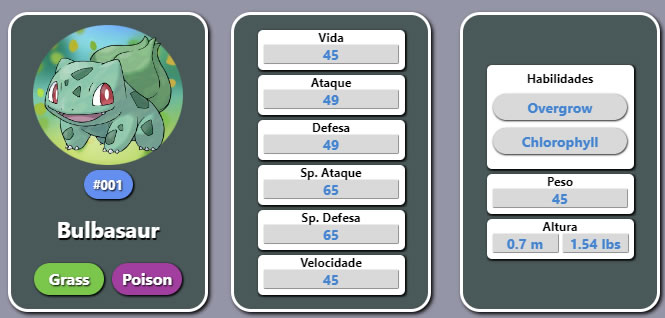

# PokéDex

Esse projeto foi desenvolvido com REACT utilizando a API de pokemon (pokeapi.co).

Foi utilizado "React Lazy Load Image Component" para criar um efeito agradável na renderização das imagens dos pokémons.

## Instalação

#### ``npm install``

Instala todas as dependencias do projeto.

#### `npm start`

Inicia um servidor local e em seguida é executado uma página web com o conteúdo do projeto. (http://localhost:3000)

## Utilização

Cada cartão exibe um pokémon diferente, ao clicar em um cartão, será exibido informações detalhadas sobre esse pokémon, após o segundo clique, será exibido as informações de suas habilidades, peso e altura.

